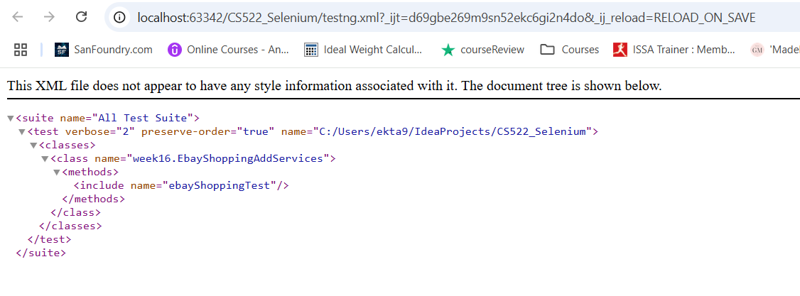
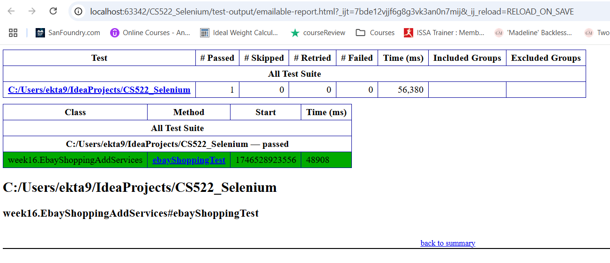

# EBay-End-To-End-Testing

This project focuses on automating critical functionalities of the eBay website using Selenium WebDriver with TestNG. 
The goal was to simulate a real user’s journey—from searching a product to adding it to the cart—ensuring stability, speed, and accuracy in test execution.

## Screenshots

### TestNG.Xml

### Emailable-Report

